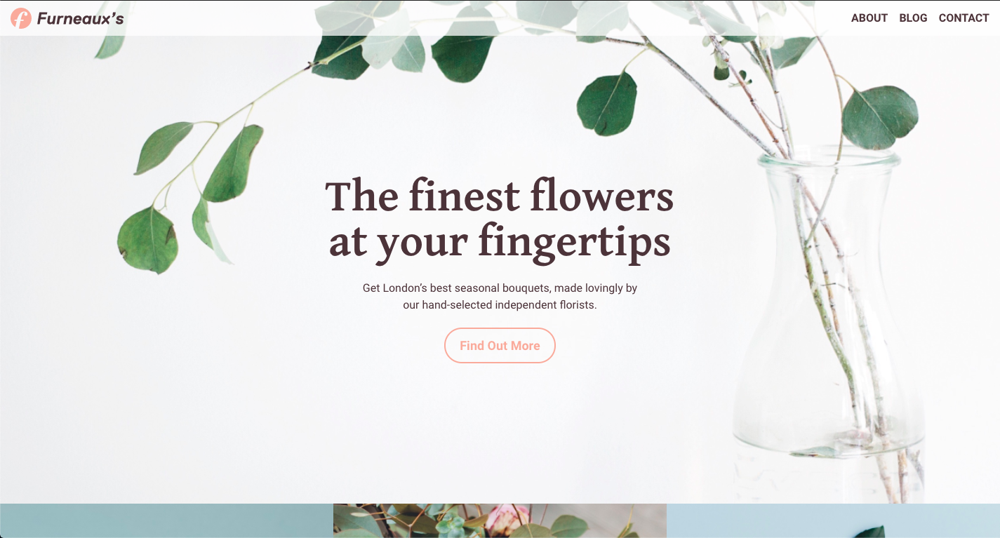
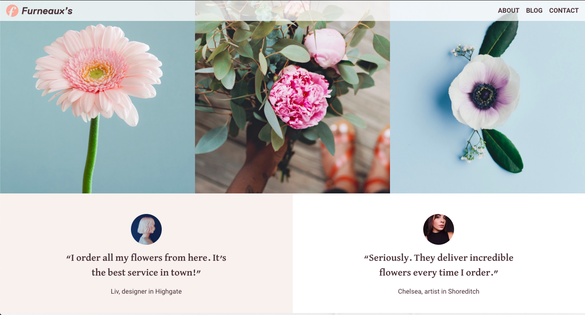
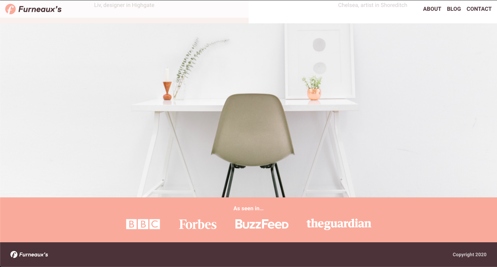

# Furneaux's
Responsive multi-column site for a florists.

## Table of contents
* [General info](#general-info)
* [Screenshots](#screenshots)
* [Technologies](#technologies)
* [Demo](#demo)
* [Features](#features)
* [Status](#status)
* [Contact](#contact)

## General info
This was the third project on the [Superhi Foundation](https://superhi.com/courses/html-css-javascript-foundation) course. It introduced more complex layouts with multiple columns, different positioning techniques in CSS and concepts like nth child. 

## Screenshots

## Technologies
* HTML5
* CSS3

## Demo
[Live Demo](https://guybroadhurst.github.io/furneauxs/)

## Features
List of features:
* Fixed header that stays at the top of the viewport when you scroll. 
* Multiple column layout.
* Elements with different levels of opacity. 

## Status
Project is: _finished_ and complete for the course.
 
## Contact
Created by [@guybroadhurst](https://www.guybroadhurst.co.uk/) - feel free to contact me!